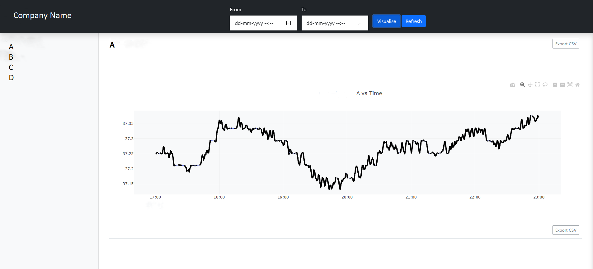

## Technical Details

In this directory, you'll find a `Dockerfile` that defines the image your code will be copied into and installed in. Specifically, your source code will be installed into a Python 3.10 virtual environment as a package via pip, along with any dependencies you've specified in a `requirements.txt` file.

You'll also find a `compose.yaml` file that defines the container that'll be used to run your code. Specifically, to serve your web-based dashboard in a local browser at http://localhost:8888/, __Docker is configured to start the container by executing `run-app`,__ the expected [entrypoint](https://setuptools.pypa.io/en/latest/userguide/entry_point.html) for your application.

### The database

The data you'll be visualizing will be in a Postgres database, also configured in `compose.yaml`. Credentials to access this database will be provided in the following environment variables in local.env:
- `POSTGRES_HOST` provides the host
- `POSTGRES_PORT` provides the port
- `POSTGRES_USER` provides the user
- `POSTGRES_PASSWORD` provides the password
- `POSTGRES_DB` provides the database

### How to test your code

Run `docker compose up` and navigate your browser to http://localhost:8888/. That's it!

## The Project

1) The dashboard allows the user to plot four series (A,B,C, and D) over time.
2) User can select a specific time window.
3) A refresh button to refresh data without refreshing the page.
4) User can download csv for that data

## The Implementation:
1) Docker:
    1. To start the container by executing `run-app`, a setup.py was created with an entrypoint.
    2. In order to use templates and static folders in Flask, MANIFEST.in is required.
    3. A Flask app named "timmins" was created to serve the dashboard. It includes an __init__.py file that contains the basic function to execute the application.
 
2) Dashboard:
    1. Flask:
        a. psycopg2 was used to establish a connection to the PostgreSQL database. 
        b. Variables were loaded from the .env file using load_dotenv('local.env'). 
        c. An API was created to retrieve data from the database based on the start and end date. 
        d. A dictionary was created with all the data and returned as JSON. 
    3. Frontend:
        a. A search form was created to get the start and end date. 
        b. The Flask API was called with the input to retrieve all the data and plot it using plotly.js. 
        c. API calls no longer require page refreshing to add data. 
        d. Clicking on the refresh button will call the API again and update the Flask without refreshing the page. 

## ----------------------------------------------------------------------------------------------------------------------------------------